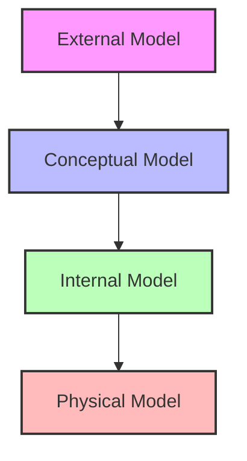
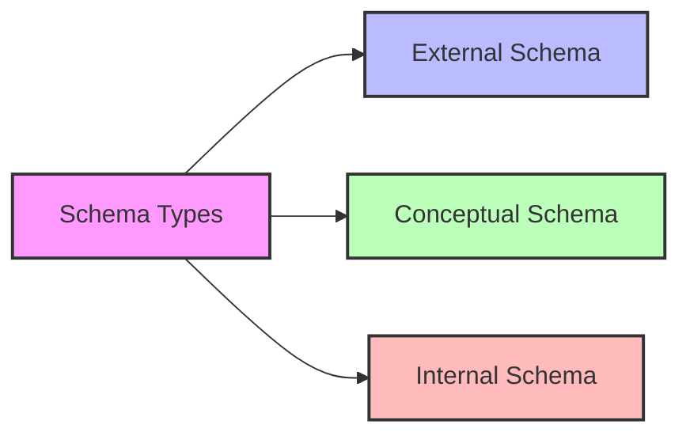
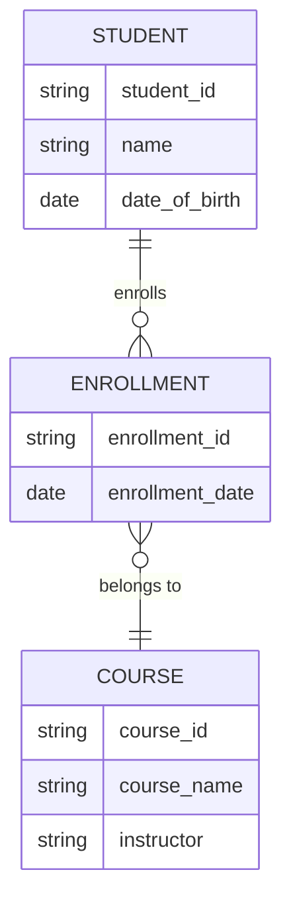

# View of Data in Database Systems

## Introduction

Understanding how data is organized and viewed in database systems is crucial for effective database design and management. This document explains the concept of "View of Data" in simple terms, with visualizations to aid comprehension.

## Data Abstraction

Data abstraction is the process of simplifying complex data systems by breaking them down into smaller, more manageable parts. It's like looking at a building from different perspectives:

- From far away (high-level abstraction), you see the overall shape.
- As you get closer (lower-level abstraction), you start to see more details like windows and doors.
- When you're inside (lowest-level abstraction), you see the intricate details of each room.

In database terms, this allows us to move from basic concepts to implementable structures.

## Levels of Data Abstraction

The ANSI/SPARC architecture defines three main levels of data abstraction:

1. **External Model**
   - This is how end-users see the data.
   - It's like different views of a house: a real estate agent sees it differently than a potential buyer.

2. **Conceptual Model**
   - This provides a global view of the entire database.
   - It's like an architect's blueprint of the whole house.

3. **Internal Model**
   - This is how the Database Management System (DBMS) sees the data.
   - It's comparable to the structural plans of the house, showing how everything fits together.

4. **Physical Model**
   - This describes how data is actually saved on storage media.
   - It's like the actual construction of the house, dealing with the physical materials and their arrangement.

## Instances and Schemas

- An **instance** is like a snapshot of the database at a particular moment.
- A **schema** is the overall structure or blueprint of the database.

Think of it this way:
- Schema = The blueprint of a house
- Instance = A photo of the house at a specific time

## Types of Schemas

1. **External Schema**
   - Represents specific views for different users or applications.
   - Like different floor plans for different purposes (e.g., family living, party hosting).

2. **Conceptual Schema**
   - Provides a high-level description of the entire database.
   - Like the overall architectural plan of the house.

3. **Internal Schema**
   - Represents how data is physically stored and structured.
   - Like the detailed construction plans of the house.

## Advantages of Different Schemas

- **External Schemas**:
  - Make it easier to identify specific data needed for each business unit.
  - Enhance security by limiting access to only necessary data.
  - Simplify application development.

- **Conceptual Schemas**:
  - Provide an easily understood overview of the entire data environment.
  - Help in understanding relationships between different parts of the database.

## ER Diagrams

Entity-Relationship (ER) diagrams are visual tools used to design external and conceptual schemas. They help in visualizing:

- Entities (objects or concepts in the database)
- Relationships between entities
- Attributes of entities
- Constraints on the data

Here's a simple example of an ER diagram:

This diagram shows:
- Students can enroll in multiple courses (one-to-many relationship)
- Each enrollment belongs to one course (many-to-one relationship)
- The attributes of each entity (e.g., student_id, name for STUDENT)

## Conclusion

Understanding the different views and levels of abstraction in database systems helps in designing, implementing, and managing databases effectively. It allows us to break down complex systems into manageable parts and cater to the needs of different users while maintaining a coherent overall structure.
